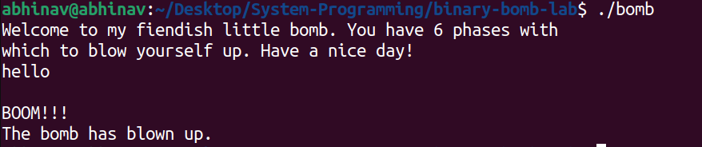
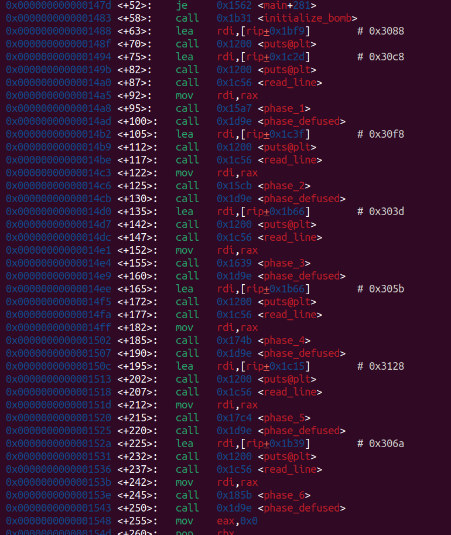
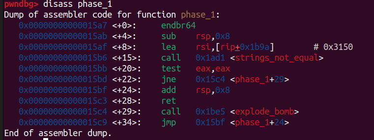
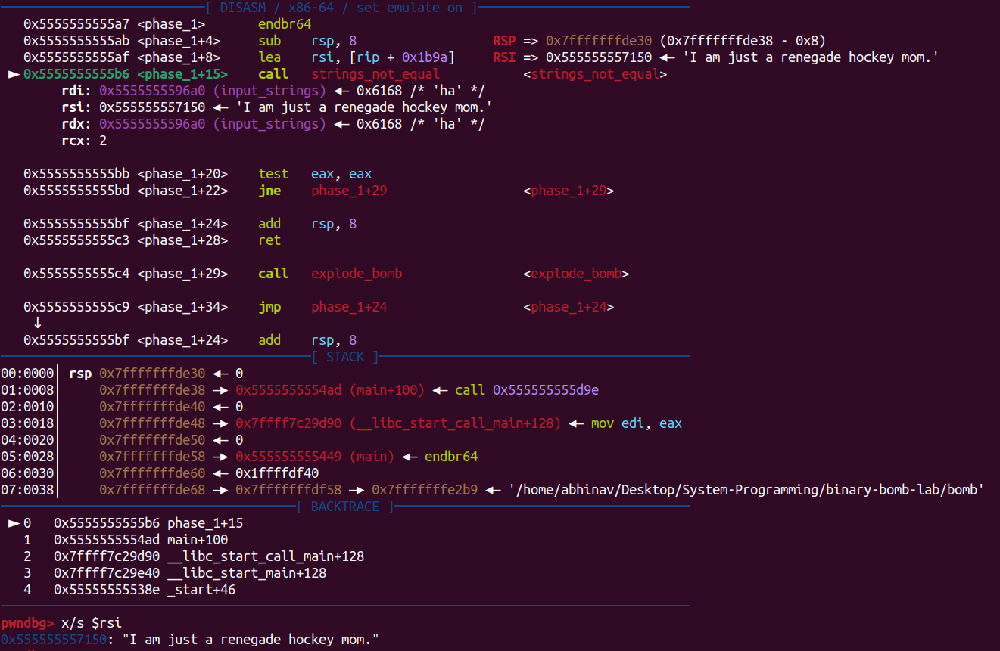

# Binary Bomb Lab

- There are 6 phases which I had to defuse.
- Any wrong input will lead to explosion of bomb.

### Disassembling
- Disassembling main using gdb(pwndbg).

- Clearly, we can see 6 phases, each of it having a function.
#### Phase 1
- Disassembling ```phase_1```.

- In ```phase_1``` function, the input string(passed through argument) in ```%rdi``` and a string at ```rip+0x1b9a``` in ```%rsi``` is passed as arguments in function ```string_not_equal```.
- If those strings are not equal, then ```explode bomb``` function is called.
- Therefore, input string should be equal to the string stored at ```rip+0x1b9a```, to prevent the explosion of bomb.
- Debugging
    - Break point at ```main+92```(just before ```phase_1``` is called).
    - Step through all of the instructions in ```phase_1``` and reached the instruction ```0x5555555555af <phase_1+8>     lea    rsi, [rip + 0x1b9a] ```.
    - Got the value of ```%rsi``` at this point.
    - This is the wanted input string.
    - Input String = "```I am just a renegade hockey mom.```".
    
